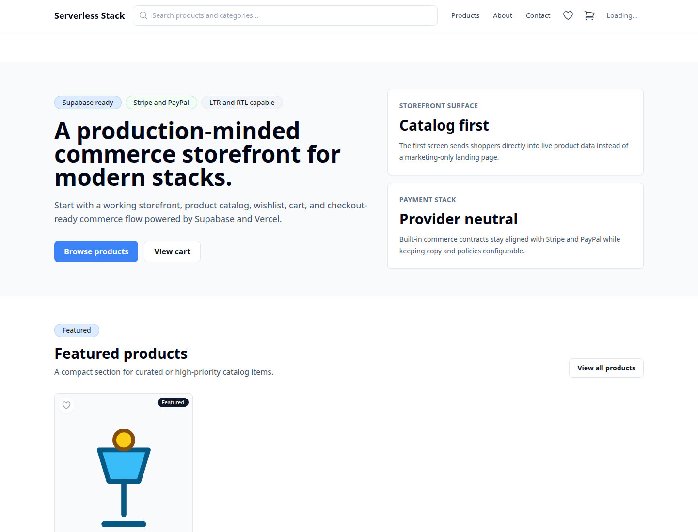
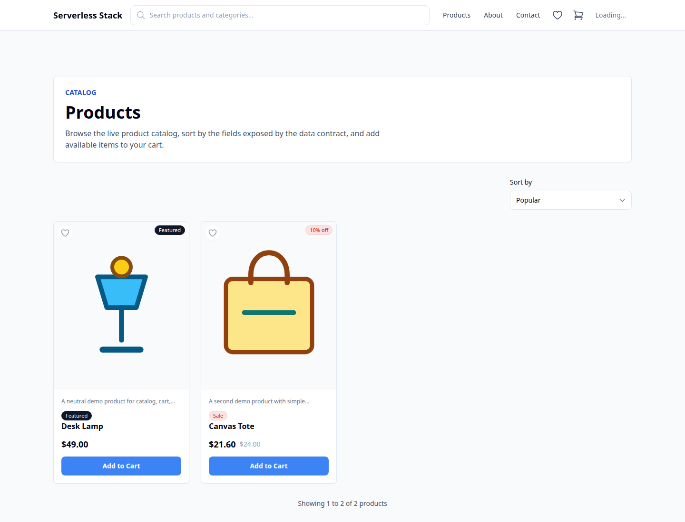

# Serverless Stack

Serverless Stack is a free, open-source commerce boilerplate for launching an online store on modern serverless infrastructure. It combines Next.js, Supabase, Vercel, Stripe, PayPal, Tailwind CSS, optional Cloudflare R2 media storage, optional Resend email, and optional Upstash Redis.

You do not need Shopify, WordPress, WooCommerce, or a VPS to start a business with this project. Bring free-tier service accounts, your own domain, and your product data; deploy the app to Vercel and let the managed services handle the database, authentication, storage, payments, email, caching, and hosting.

This is not designed as a human page-builder or drag-and-drop customization product. It is designed as an AI-agent-friendly boilerplate: the codebase is structured, typed, documented, and testable so builders can ask AI agents to change the UI, add features, swap copy, adjust business rules, localize the store, or make the project fully their own.



## Why It Exists

Most small commerce projects do not need a hosted storefront subscription, a WordPress plugin stack, or a manually managed server. They need a real storefront foundation that can be customized quickly:

- Serverless hosting on Vercel instead of VPS management.
- Supabase Postgres instead of running and patching your own database server.
- Stripe and PayPal checkout flows instead of building payment plumbing from scratch.
- A typed application structure that AI agents can safely inspect and modify.
- Clear environment and deployment docs so the owner mostly needs API keys and a domain.

## Feature Priorities

1. Storefront and catalog
   - Product listing, product detail pages, featured products, sale badges, categories, tags, related products, stock-aware product cards, and search entry points.
   - Client-side sorting and pagination for a responsive catalog experience.

2. Cart, wishlist, and checkout
   - Persistent cart, wishlist, quantity controls, stock checks, guest checkout, shipping contact fields, promo code support, and checkout handoff.
   - Stripe Checkout and PayPal order creation/capture routes are built in.

3. Admin operations
   - Admin dashboard surfaces for products, categories, tags, users, transactions, promo codes, settings, media, and bulk operations.
   - Role-protected admin routes and service-layer business logic.

4. Payments and order records
   - Stripe and PayPal provider support, webhook endpoints, payment status tracking, transaction records, transaction items, invoices, provider references, and idempotent PayPal capture handling.

5. Database and security foundation
   - Supabase Postgres schema, migrations, seed data, RLS policies, service-role boundaries, schema validation helpers, and documented security expectations.

6. Media and storage
   - Product media tables, variant-aware media support, Cloudflare R2-compatible object storage helpers, optional image resizing, and backup helper configuration.

7. Accounts, email, and activity
   - NextAuth integration, user profile workflows, password handling, OTP/email infrastructure, activity logs, and user transaction history.

8. Production-oriented operations
   - Vercel deployment docs, environment templates, release checklist, payment deployment checklist, logging, optional Redis cache/rate limiting, unit/integration/E2E test structure, and route/config verification scripts.



## What You Need To Launch

For a basic production store, you need:

- A domain.
- A Vercel account for hosting.
- A Supabase project for Postgres and API access.
- Stripe and/or PayPal API keys for payments.
- Optional Cloudflare R2 credentials for product media.
- Optional Resend or SMTP credentials for email.
- Optional Upstash Redis credentials for cache and rate limiting.

Most of these services have free tiers that are enough to start building, testing, and launching a small store.

## AI-Agent Customization Workflow

The intended workflow is:

1. Clone the project and configure the environment.
2. Run the app locally with the seed schema.
3. Ask an AI coding agent to make the product, brand, UI, language, checkout rules, admin flows, or integrations match your business.
4. Run tests and preview deployments.
5. Connect your domain and launch.

Good agent tasks include:

- "Change the storefront design for a premium skincare brand."
- "Add a product bundle feature."
- "Localize the public pages to Persian and keep admin in English."
- "Add delivery-zone pricing to checkout."
- "Replace the seeded catalog with my product CSV import workflow."
- "Customize the admin dashboard for a single-owner business."

## Stack

- Next.js App Router with React and TypeScript.
- Supabase Postgres with schema and RLS migrations.
- NextAuth for application authentication.
- Stripe and PayPal payment flows.
- Tailwind CSS for UI styling.
- Cloudflare R2-compatible object storage for product media.
- Optional Resend or SMTP email delivery.
- Optional Upstash Redis cache and rate limiting.
- Vercel-oriented deployment.

## Quick Start

1. Install dependencies:

   ```bash
   npm install
   npm --prefix tests install
   ```

2. Run the terminal setup wizard:

   ```bash
   npm run setup
   ```

   The wizard creates `.env` from `.env.example` when needed, generates `NEXTAUTH_SECRET`, checks required service keys, checks Vercel login/link state, verifies the Supabase connection, applies the initial schema to an empty database, seeds demo catalog data, checks the Supabase REST API, and runs repository verification.

3. Start development:

   ```bash
   npm run dev
   ```

4. Open `http://localhost:3000`.

### Manual Setup

Use this path when you want to apply each step yourself.

1. Create local environment files:

   ```bash
   cp .env.example .env
   cp .env.example tests/.env
   ```

2. Configure required variables in `.env`:
   - `DATABASE_URL`
   - `NEXTAUTH_URL`
   - `NEXTAUTH_SECRET`
   - `NEXT_PUBLIC_APP_URL`
   - `NEXT_PUBLIC_SUPABASE_URL`
   - `NEXT_PUBLIC_SUPABASE_PUBLISHABLE_KEY`
   - `SUPABASE_SECRET_KEY`
   - Stripe and PayPal sandbox credentials if you want real checkout calls.

3. Apply the Supabase schema and seed data:

   ```bash
   psql "$DATABASE_URL" -v ON_ERROR_STOP=1 -f supabase/migrations/20260531190011_initial_public_schema.sql
   psql "$DATABASE_URL" -v ON_ERROR_STOP=1 -f supabase/seed.sql
   psql "$DATABASE_URL" -c "notify pgrst, 'reload schema';"
   ```

4. Validate the payment schema when a database is available:

   ```bash
   psql "$DATABASE_URL" -v ON_ERROR_STOP=1 -f scripts/db/validate_payment_schema.sql
   ```

5. Start development:

   ```bash
   npm run dev
   ```

6. Open `http://localhost:3000`.

## Environment Variables

`.env.example` lists all required and optional variables. Use local, preview, and production values that belong to your own Supabase, payment, storage, email, and cache accounts.

Required for the app:

- `DATABASE_URL`
- `NEXTAUTH_URL`
- `NEXTAUTH_SECRET`
- `NEXT_PUBLIC_APP_URL`
- `NEXT_PUBLIC_SUPABASE_URL`
- `NEXT_PUBLIC_SUPABASE_PUBLISHABLE_KEY`
- `SUPABASE_SECRET_KEY`

Required for built-in payment providers:

- `STRIPE_SECRET_KEY`
- `NEXT_PUBLIC_STRIPE_PUBLISHABLE_KEY`
- `STRIPE_WEBHOOK_SECRET`
- `PAYPAL_CLIENT_ID`
- `PAYPAL_CLIENT_SECRET`
- `PAYPAL_WEBHOOK_ID`
- `PAYPAL_ENV`

Optional integrations:

- Cloudflare R2-compatible storage: `R2_*`
- Resend or SMTP email: `RESEND_API_KEY`, `RESEND_SMTP_*`, `EMAIL_SMTP_*`
- Upstash Redis cache/rate limiting: `UPSTASH_REDIS_REST_URL`, `UPSTASH_REDIS_REST_TOKEN`
- Cloudflare Image Resizing: `NEXT_PUBLIC_CLOUDFLARE_IMAGE_RESIZING_ENABLED`

## Useful Commands

```bash
npm run setup            # Guided terminal setup
npm run setup:check      # Non-mutating setup health check
npm run dev              # Start local development
npm run build            # Build for production
npm start                # Start production build
npm run lint             # Run ESLint
npm run verify           # Run repository verification scripts
npm run test:unit        # Run unit tests
npm run test:integration # Run integration tests
npm run test:e2e         # Run Playwright tests
```

## Deployment

Vercel is the primary deployment target. Create a Vercel project, add the variables from `.env.example`, and register separate Stripe and PayPal webhooks for each deployed environment.

Payment webhook endpoints:

- Stripe: `/api/transactions/webhook-stripe`
- PayPal: `/api/transactions/webhook-paypal`

See `docs/DEPLOYMENT.md`, `docs/PAYMENT_METHOD_DEPLOYMENT.md`, and `docs/FEATURES.md` for detailed checklists.

## Project Layout

```text
src/
  app/          Next.js routes and route handlers
  components/   Reusable React components
  config/       Application configuration
  hooks/        Client hooks
  lib/          Provider clients and shared utilities
  services/     Business logic
  store/        Zustand state stores
  types/        TypeScript types
database/       Schema contract and schema validation helpers
docs/           Public setup and operations documentation
tests/          Unit, integration, and E2E tests
```

## Documentation

- `docs/FEATURES.md`
- `docs/SETUP_CHECKLIST.md`
- `docs/TERMINAL_SETUP.md`
- `docs/ENVIRONMENT.md`
- `docs/DEPLOYMENT.md`
- `docs/RELEASE_CHECKLIST.md`
- `docs/PAYMENT_METHOD_DEPLOYMENT.md`
- `docs/R2_SETUP.md`
- `tests/README.md`

## Contributing

Read `CONTRIBUTING.md` before opening a pull request. The repository is licensed under the MIT License.
